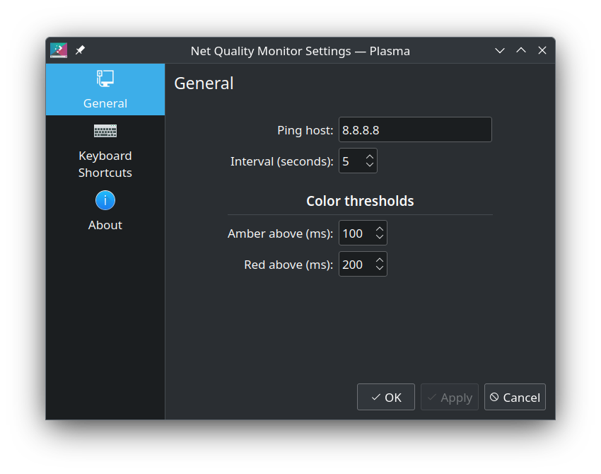

# Net Quality Monitor — KDE Plasma Plasmoid

A minimal KDE Plasma 5 panel widget that shows internet connection quality in real time.




## What it shows

- **Ping latency** in milliseconds (avg RTT to 8.8.8.8)
- **Packet loss** percentage (only shown when > 0%)
- **Color-coded status** — changes automatically without any interaction:
  - Green: online, ping < 100 ms
  - Amber: ping 100–200 ms
  - Red: ping > 200 ms or any packet loss

Updates every 5 seconds.

## Requirements

- KDE Plasma 5.20 or later (Plasma 6 is not supported)
- `ping` utility (standard on all Linux systems)

## Supported distributions

Requires **Plasma 5** — Plasma 6 uses a different API and is not yet supported.

| Distribution | Version             | Plasma      |
| ------------ | ------------------- | ----------- |
| Ubuntu       | 22.04 LTS (Jammy)   | 5.24        |
| Ubuntu       | 23.04 (Lunar)       | 5.27        |
| Ubuntu       | 23.10 (Mantic)      | 5.27        |
| Ubuntu       | 24.04 LTS (Noble)   | 5.27        |
| Kubuntu      | 22.04 – 24.04       | 5.24 – 5.27 |
| KDE neon     | (Ubuntu 22.04 base) | 5.27        |
| Debian       | 11 (Bullseye)       | 5.20        |
| Debian       | 12 (Bookworm)       | 5.27        |
| Linux Mint   | 21.x                | 5.24 – 5.27 |
| openSUSE Leap| 15.4 – 15.6         | 5.27        |
| Fedora       | 38, 39              | 5.27        |
| Alma/Rocky   | 9.x (EPEL)          | 5.27        |

> Ubuntu 24.10+ and Debian 13 ship Plasma 6 — not supported.

## Installation

### Option 1: Package manager (recommended)

Download the latest `.deb` or `.rpm` from the [Releases](https://github.com/lucomsky/plasma-applet-net-quality/releases) page.

**Debian/Ubuntu-based:**
```bash
sudo dpkg -i plasma-applet-net-quality_*_all.deb
```
To uninstall: `sudo dpkg -r plasma-applet-net-quality`

**Fedora/openSUSE/RHEL-based:**
```bash
sudo rpm -i plasma-applet-net-quality-*.noarch.rpm
```
To uninstall: `sudo rpm -e plasma-applet-net-quality`

The widget is installed system-wide and available to all users. After installation, right-click the panel → **Add Widgets** → search **Net Quality** → drag onto panel.

### Option 2: Script (per-user, no root)

```bash
git clone https://github.com/YOUR_USERNAME/plasma-applet-net-quality.git
cd plasma-applet-net-quality
bash install.sh
```

### Option 3: Manual (per-user, no root)

```bash
git clone https://github.com/YOUR_USERNAME/plasma-applet-net-quality.git
mkdir -p ~/.local/share/plasma/plasmoids/
cp -r plasma-applet-net-quality ~/.local/share/plasma/plasmoids/net.quality.monitor
kpackagetool5 --install ~/.local/share/plasma/plasmoids/net.quality.monitor --type Plasma/Applet
```

Then right-click the panel → **Add Widgets** → search **Net Quality** → drag onto panel.

## Uninstall

```bash
kpackagetool5 --remove net.quality.monitor --type Plasma/Applet
rm -rf ~/.local/share/plasma/plasmoids/net.quality.monitor
```

## File structure

```
net.quality.monitor/
  metadata.json        — widget metadata
  contents/ui/
    main.qml           — all UI and logic (~160 lines QML)
```

## License

[GPL-2.0-or-later](LICENSE)
